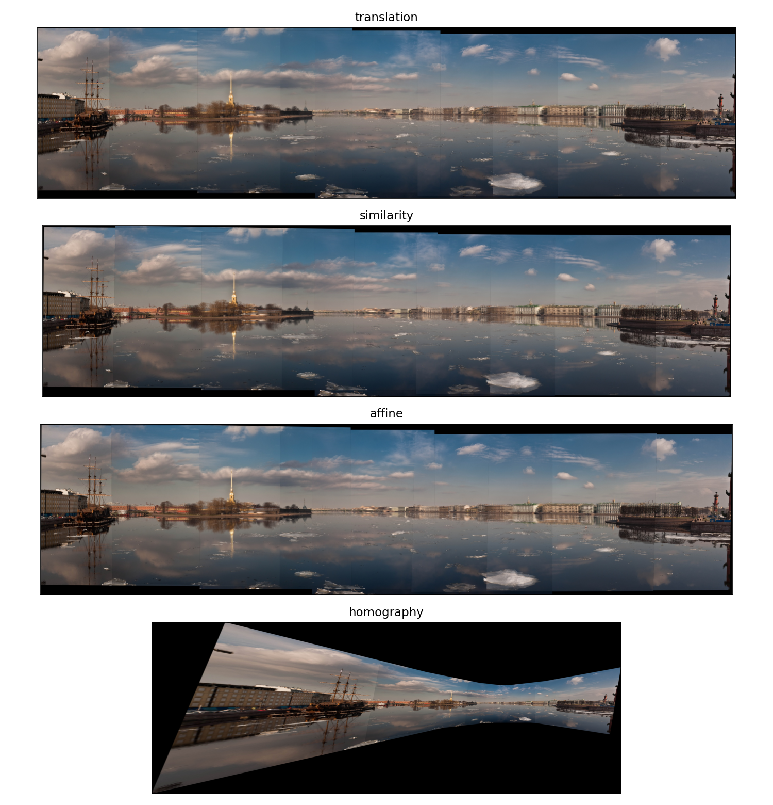
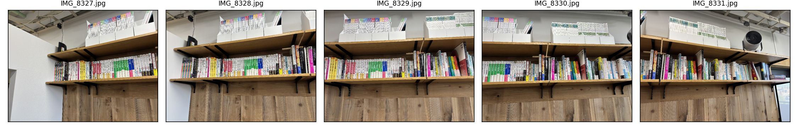
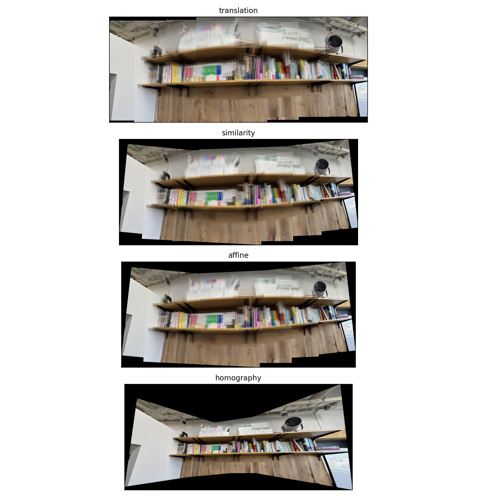

# Image Stitching — Four Motion Models and Homography

A complete pipeline that aligns a series of overlapping photos of one scene and
blends them into a single **stitched panorama**. It detects and matches SIFT
features, groups them into unique multi-image **tracks** (union–find), estimates
a per-image alignment under four motion models — **translation, similarity,
affine** (from-scratch linear least squares) and **homography** (OpenCV) — then
warps every frame onto one canvas and averages the overlap.

What this tool does:

1. Take **a series of overlapping photos** of one scene (three or more).
2. Detect and match feature points (SIFT + Lowe's ratio test + mutual-best).
3. Assign a **unique index _i_** to every track across the whole series.
4. Estimate a transform per image with the **linear solution** — translation,
   similarity, affine — and **homography** via OpenCV.
5. Compute the size of the composite canvas.
6. Warp each image into its final position (`cv2.warpPerspective`).
7. Average the overlap into the final panorama.

## Setup

Dependencies and the Python toolchain (>= 3.10) are managed with [uv](https://docs.astral.sh/uv/).

```bash
uv sync
```

This creates a `.venv` and installs the dependencies pinned in `uv.lock`.

## Usage

```bash
# Bundled sample (OpenCV "boat" panorama, 6 frames) — all four models
uv run python src/run_stitching.py --input images/sample --output results/boat

# Your own photos
uv run python src/run_stitching.py --input images/custom --output results/custom \
  --detector sift --max-dim 1200

# Rebuild the report figures from a results folder
uv run python src/make_figures.py --results results/boat --input images/sample
```

Main options of `run_stitching.py`:

| Option | Default | Description |
|---|---|---|
| `--input` | (required) | folder of overlapping images (sorted by filename = series order) |
| `--output` | (required) | output folder |
| `--detector` | `sift` | feature detector: `sift`, `akaze`, or `orb` |
| `--ratio` | `0.75` | Lowe ratio test threshold (smaller is stricter) |
| `--max-dim` | `1200` | the longer image side is downscaled to this [px] |
| `--ref-idx` | middle | reference image whose transform is identity |
| `--models` | all four | subset of `translation similarity affine homography` |

The bundled sample lives in `images/sample/` (re-creatable by curl, below). Put
your **own** photos in `images/custom/` — its contents are git-ignored.

### Recreate the sample dataset

The OpenCV "boat" panorama (6 frames, ~4 MB):

```bash
mkdir -p images/sample
cd images/sample
for i in 1 2 3 4 5 6; do
  curl -fsSL -o "boat${i}.jpg" \
    "https://raw.githubusercontent.com/opencv/opencv_extra/master/testdata/stitching/boat${i}.jpg"
done
```

### Tips for taking your own photos

- Shoot **three or more** frames, panning so that **consecutive frames overlap by
  ~30–50%**.
- For a clean panorama, **rotate the camera in place** (pan about its optical
  axis) rather than walking sideways — that is exactly the case a single
  homography models, so the seams in the centre vanish.
- Keep exposure and zoom fixed; a textured scene yields more stable matches.
- **Name the files so that their sorted order is the left-to-right order**
  (e.g. `01.jpg, 02.jpg, …`); `load_images` reads them sorted by name.
- iPhone **HEIC** is fine to keep as the original, but OpenCV reads JPG/PNG.
  Convert it alongside (honouring EXIF rotation), e.g. with a throwaway
  `pillow-heif` environment that does not touch the lockfile:
  `uv run --with pillow-heif python <convert script>`. Both the HEIC and the JPG
  can sit in `images/custom/`; only the JPG is loaded.

## Method

The pipeline (`src/stitching.py`):

1. **Features & matching** — SIFT keypoints/descriptors; adjacent pairs matched
   with `cv2.BFMatcher` k-NN (k=2) + Lowe's ratio test + a mutual-best
   (cross-check) test. AKAZE/ORB are also supported.
2. **Multi-image tracks** — pairwise matches form a graph over all keypoints;
   connected components (union–find) become tracks, each carrying a **unique
   index _i_** that identifies the same physical point across the series.
3. **Linear solution (translation / similarity / affine)** — every model is
   re-parameterised so that `M(p=0) = I`, so with Jacobian `J`, `x' - x = J(x) p`.
   This is solved in closed form by the normal equations `A p = b`,
   `A = Σ J(xᵢ)ᵀ J(xᵢ)`, `b = Σ J(xᵢ)ᵀ Δxᵢ` (no `cv2.estimateAffine2D`).
4. **Homography** — `cv2.findHomography(RANSAC)` (or `cv2.getPerspectiveTransform`
   with exactly 4 points).
5. **Fair comparison** — all four models are fit on the **same RANSAC inlier
   set** per pair, so the reported reprojection RMSEs are directly comparable.
6. **Canvas & warp** — the four corners of each image are projected to size the
   union canvas; every image is warped with `cv2.warpPerspective` and the
   panorama is the pixel-wise mean over the overlapping warps.

The middle image is the reference; transforms chain outward. The three linear
solvers are exact closed-form least squares — on noise-free correspondences they
recover the generating transform to machine precision.

## Outputs

`run_stitching.py` writes to the `--output` folder:

- `matches/matches_ii_jj.jpg` — pairwise SIFT matches (top 80 by distance).
- `tracks.png` / `tracks.json` — multi-image tracks (union–find), unique index _i_.
- `pano_{model}.jpg` / `pano_{model}_crop.jpg` — stitched panorama per model.
- `M_{model}_NN.txt` — the 3×3 transform applied to each image.
- `summary.json` — RMSE per pair, match counts, and all transforms.

## Results (bundled boat sample)

Six frames of a coastal panorama (OpenCV stitching test set), longer side
1200 px, reference image _r_=3, **all four models fit on the same RANSAC inliers
per pair**. 2717 multi-image tracks; ~300–800 inlier matches per adjacent pair.

| model | mean inlier reprojection RMSE [px] |
|---|---|
| translation | 8.48 |
| similarity | 8.15 |
| affine | 7.91 |
| **homography** | **0.92** |

The homography is an **order of magnitude** tighter than the linear models — it
is the exact model for a rotating camera (per-pair RMSE 0.43–1.72 px) — while the
three linear models leave an ~8 px residual that shows up as hairline seams.



## Example: stitching your own photos

The same pipeline on five hand-held phone photos of a bookshelf — the kind of
input this tool is built for. A bookshelf is near-planar, so the homography is
essentially exact (per-pair RMSE ≈ 1.3 px) while the linear models leave visible
seams where the shelf edges fail to line up.




